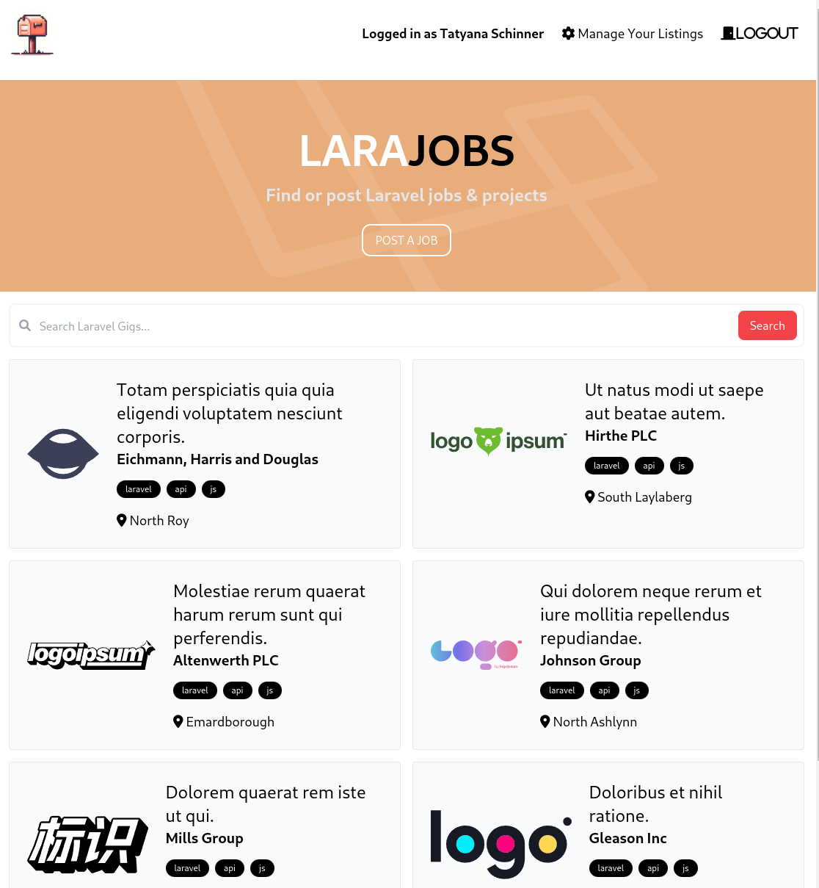
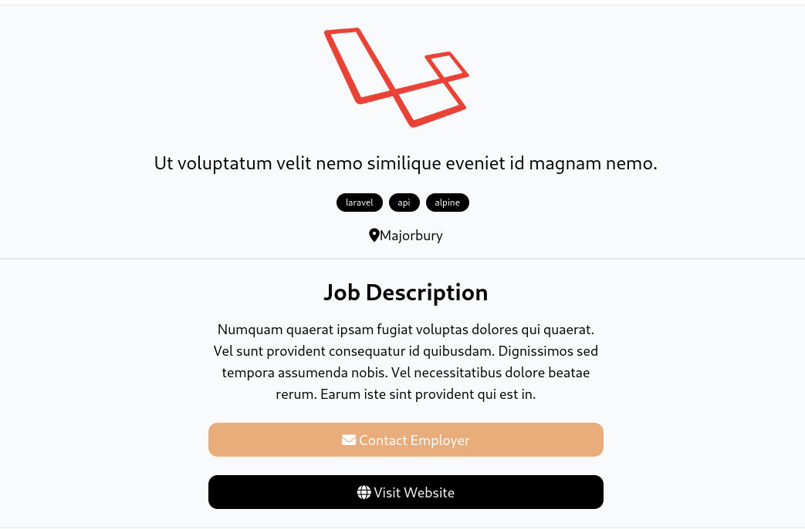

# LaraJobs

This is a simple job posting board built using the Laravel framework. It allows users to post job listings and browse existing listings. Visitors can view job listings and sort them through tags and search filters.

LaraJobs posting board is a web application built on top of the Laravel framework and MySQL database. Leveraging Laravel's migration system, the database schema was created and managed effortlessly. The application follows REST principles, providing clear and intuitive endpoints for performing CRUD operations on job listings.

## Features
- **Job Posting:** Users can create and post job listings.
- **Job Browsing:** Visitors can browse through existing job listings and can directly send an email or view the posting company's website.
- **User Authentication:** Secure user authentication system for creating and managing accounts.
- **Manage Panel:** Features a bare bones admin panel for editing or deleting job listings, along with company name and logo securely.

### Viewing all listings


### Viewing a listing


## Installation

1. Clone the repository to your local machine:
```bash
git clone https://github.com/gitnjole/lara-jobs
```

2. Install dependencies:
```bash
composer install
```

3. Create a copy of '.env.example' file and rename it to '.env' where you will modify your configuration for the application and database.

4.  Migrate the database:
```bash
php artisan migrate
```

5. Serve the application:
```bash
php artisan serve
```

## Usage

- Register for an account to post job listings
- Users can access the admin panel by visting '/manage' or clicking on the 'Manage Your Listings` link on the upper right

## Contributing / Tweaking

Since this is a personal project, I'd encourage for this project to be cloned and renamed so you can use it and tweak it for your own purposes.

If you have suggestions please see the Further ideas chapter below first.

## Further ideas

Currently the application is in the working state, but as I find more time to refine it it will become more fleshed out.
I have a couple ideas for improving this project so you can check back after some time and see if I've done any further work!

**Company banners** have been implemented and logos are now permanent throughout your listings!
- ~~**Company banners:** Users need to post their company logo every time they post a job which gets very tedious and storage consuming. I could refine this so that users need to post a company logo which would be permanent throughout their account listings (but changeable), and if they wish they can post additional 'banners' on their listings to customize the look of the listing~~

**Redefined User-Listings relations!** Now, company data will be permanent throughout listings so you don't have to insert same data every time!
- ~~**Redefine User-Company-Listings relations:** The user is currently essentially the company, with the field 'name' synonymous with the name of their company. However, this setup can lead to confusion and inefficiencies. To address this, I plan on investing time in redefining the database structure to allow for discrete, precise attributes for users and companies. Additionally, it's important to eliminate the need to retype the company name every time a listing is posted, along with location/company description, etc.~~

- **User showcase:** Instead of making it purely job listing focused, users could also post their own 'willing to work' listings where companies can reach out to
potential employees. This feature would require me to rewrite the home page and make various tweaks so that the website knows what to display to you based on your account type (for example, if you're a company you might not want to see other companies listing jobs, but you might be interesed in seeing people offering their skills).

- **Direct apply through application:** Could mimic LinkedIn features of being able to send a quick message and CV file to the company mail. Can also implement custom questions, for example users would have to answer specific questions like 'How many years of experience do you have with X?'

- **API Integration**

Projected complexity: Complex (Controller and Model refactoring, revamping business logic)